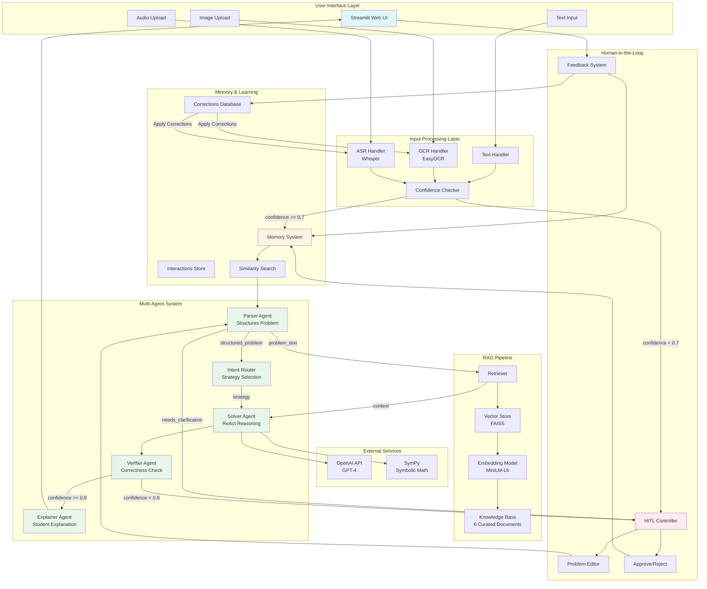

# AI Math Mentor - Architecture Documentation

## System Overview

AI Math Mentor is a production-grade multimodal AI system designed to solve JEE-level mathematics problems with transparency, verification, and continuous learning capabilities.

## Architecture Diagram



## Component Details

### 1. User Interface Layer (Streamlit)

**Responsibilities:**
- Accept multimodal input (text, image, audio)
- Display solution with step-by-step breakdown
- Show agent execution trace
- Display RAG sources
- Collect user feedback

**Technologies:**
- Streamlit 1.28+
- Custom CSS for styling
- Session state management

---

### 2. Input Processing Layer

#### Text Handler
- Direct text input processing
- Basic cleaning and validation
- 100% confidence (no preprocessing errors)

#### OCR Handler (EasyOCR)
- Image text extraction
- Multi-language support (English primary)
- Confidence scoring per detection
- Bounding box detection

**Threshold:** 0.7 (triggers HITL if below)

#### ASR Handler (Whisper)
- Audio transcription
- Math phrase conversion
  - "square root of" → √
  - "x squared" → x²
  - "plus" → +
- Multiple model sizes (tiny/base/small/medium/large)

**Threshold:** 0.7 (triggers HITL if below)

---

### 3. RAG Pipeline

#### Knowledge Base
6 curated documents covering:
1. Algebra formulas and concepts
2. Calculus (limits, derivatives, optimization)
3. Probability concepts
4. Linear algebra basics
5. Common mistakes
6. Solution templates

**Format:** Markdown files in `knowledge_base/`

#### Embedding Model
- **Model:** sentence-transformers/all-MiniLM-L6-v2
- **Dimensions:** 384
- **Speed:** Fast inference
- **Quality:** Good for semantic search

#### Vector Store
- **Engine:** FAISS (CPU version)
- **Index Type:** Flat L2
- **Persistence:** Local storage
- **Chunking:** RecursiveCharacterTextSplitter
  - Chunk size: 500 characters
  - Overlap: 50 characters

#### Retrieval
- **Top-K:** 3 documents (configurable)
- **Similarity:** Cosine similarity
- **Citation:** Source tracking for transparency

---

### 4. Multi-Agent System

#### Agent 1: Parser Agent

**Role:** Convert raw text to structured format

**Input:**
```json
{
  "raw_text": "Solve x² + 5x + 6 = 0",
  "input_type": "text|image|audio"
}
```

**Output:**
```json
{
  "problem_text": "Solve x² + 5x + 6 = 0",
  "topic": "algebra",
  "variables": ["x"],
  "constraints": ["x is real"],
  "equations": ["x² + 5x + 6 = 0"],
  "needs_clarification": false,
  "confidence": 0.95
}
```

**LLM Used:** GPT-4 (temperature: 0.3)

---

#### Agent 2: Intent Router Agent

**Role:** Determine solution strategy

**Output:**
```json
{
  "strategy": "symbolic_manipulation",
  "tools": ["sympy"],
  "approach": "Use quadratic formula or factoring",
  "confidence": 0.9
}
```

**Strategies:**
- symbolic_manipulation
- numerical_computation
- step_by_step_derivation
- probability_analysis
- matrix_operations

---

#### Agent 3: Solver Agent

**Role:** Solve problem with ReAct reasoning

**Features:**
- Step-by-step breakdown
- SymPy integration for symbolic math
- RAG context utilization
- Intermediate reasoning

**Output:**
```json
{
  "steps": [
    "Identify coefficients: a=1, b=5, c=6",
    "Calculate discriminant: D = 25 - 24 = 1",
    "Apply quadratic formula: x = (-5 ± 1)/2",
    "Simplify: x = -2 or x = -3"
  ],
  "final_answer": "x = -2 or x = -3",
  "confidence": 0.95
}
```

**LLM Used:** GPT-4 (temperature: 0.3)

---

#### Agent 4: Verifier Agent

**Role:** Verify solution correctness

**Checks:**
1. Mathematical correctness (substitution)
2. Domain validity (√, log, division constraints)
3. Constraint satisfaction
4. Common mistake patterns

**Output:**
```json
{
  "is_correct": true,
  "confidence": 0.95,
  "issues_found": [],
  "requires_hitl": false
}
```

**HITL Trigger:** Confidence < 0.8 OR issues found

**LLM Used:** GPT-4 (temperature: 0.2 - more deterministic)

---

#### Agent 5: Explainer Agent

**Role:** Create student-friendly explanation

**Features:**
- WHY each step (not just WHAT)
- Key concepts highlighted
- Common mistakes to avoid
- Helpful tips and intuition

**Output:**
```json
{
  "explanation": "To solve this quadratic equation...",
  "key_concepts": ["Quadratic Formula", "Discriminant"],
  "common_mistakes": ["Forgetting negative sign in formula"],
  "tips": ["Always verify by substitution"]
}
```

**LLM Used:** GPT-4 (temperature: 0.5 - more creative)

---

### 5. Memory & Self-Learning System

#### Interaction Storage

**Format:** JSONL (one interaction per line)

**Fields:**
- timestamp
- raw_input
- input_type
- parsed_problem
- retrieved_context
- solution
- verification
- explanation
- user_feedback

**Purpose:**
- Audit trail
- Learning from patterns
- Similarity search

#### Corrections Database

**Format:** JSON

**Structure:**
```json
{
  "ocr_corrections": {
    "x²2": "x²",
    "Iog": "log"
  },
  "asr_corrections": {
    "ex squared": "x²"
  }
}
```

**Application:** Runtime correction before processing

#### Similarity Search

**Method:** Keyword-based (production: use embeddings)

**Use Case:**
- Find similar past problems
- Reuse successful patterns
- Show user related solutions

---

### 6. Human-in-the-Loop System

#### Trigger Conditions

1. **Low Confidence:**
   - OCR confidence < 0.7
   - ASR confidence < 0.7
   - Verifier confidence < 0.8

2. **Ambiguity:**
   - Parser sets needs_clarification = true
   - Missing information
   - Unclear problem statement

3. **Verification Issues:**
   - Domain violations
   - Constraint conflicts
   - Cannot verify correctness

4. **User Request:**
   - Manual review request
   - Rejected solution

#### Human Actions

1. **Edit Problem:** Correct OCR/ASR errors
2. **Approve Solution:** Confirm correctness
3. **Reject Solution:** Mark as incorrect
4. **Provide Correction:** Supply correct answer
5. **Submit Feedback:** Comments and suggestions

#### Learning Loop

```
User Correction → Store in Memory → Apply to Future Inputs
```

---

## Data Flow Example

### Example: Solving "x² + 5x + 6 = 0"

1. **User Input (Text):**
   - User types problem in UI
   - Text handler processes (confidence: 1.0)

2. **Memory Check:**
   - System searches for similar problems
   - Finds 2 similar quadratic equations from past

3. **Parser Agent:**
   - Structures problem
   - Topic: algebra
   - Variables: [x]
   - Equations: ["x² + 5x + 6 = 0"]
   - Confidence: 0.95

4. **RAG Retrieval:**
   - Queries: "quadratic equation x² + 5x + 6 = 0"
   - Retrieves: algebra_formulas.md, solution_templates.md
   - Top-3 relevant chunks

5. **Intent Router:**
   - Strategy: symbolic_manipulation
   - Tools: [sympy]

6. **Solver Agent:**
   - Step 1: Identify a=1, b=5, c=6
   - Step 2: Calculate D = 25 - 24 = 1
   - Step 3: Apply formula
   - Step 4: Get x = -2 or x = -3
   - Confidence: 0.95

7. **Verifier Agent:**
   - Check: (-2)² + 5(-2) + 6 = 0 ✓
   - Check: (-3)² + 5(-3) + 6 = 0 ✓
   - Domain: No restrictions violated
   - Confidence: 0.95
   - requires_hitl: false

8. **Explainer Agent:**
   - Creates student-friendly explanation
   - Highlights quadratic formula concept
   - Warns about sign errors

9. **Store in Memory:**
   - Complete interaction saved
   - Available for future similarity search

10. **Display Results:**
    - Show solution in UI
    - Display execution trace
    - Show RAG sources
    - Collect feedback

---

## Technology Stack

### Frontend
- **Streamlit:** Web UI framework
- **CSS:** Custom styling

### Backend
- **Python 3.8+:** Main language
- **OpenAI API:** LLM for agents
- **LangChain:** RAG framework orchestration

### Multimodal Processing
- **EasyOCR:** Image text extraction
- **Whisper:** Audio transcription
- **Pillow:** Image processing

### Mathematical Computation
- **SymPy:** Symbolic mathematics
- **NumPy:** Numerical operations
- **SciPy:** Scientific computing

### Vector Search
- **FAISS:** Efficient similarity search
- **sentence-transformers:** Embeddings

### Storage
- **JSONL:** Interaction logs
- **JSON:** Corrections database
- **Local filesystem:** Vector store persistence

---

## Security & Privacy

### Data Handling
- User data stored locally (not cloud)
- No third-party data sharing (except OpenAI API)
- API keys in environment variables (not code)

### Input Validation
- Text sanitization
- File type validation
- Size limits enforced

### API Security
- Rate limiting awareness
- Error handling for API failures
- Graceful degradation

---

## Scalability Considerations

### Current Design (Single User)
- Local storage
- In-memory processing
- Single-threaded execution

### Production Scaling (Future)
- Database backend (PostgreSQL)
- Redis caching
- Message queue (Celery)
- Load balancing
- Distributed vector store

---

## Performance Characteristics

### Response Times
- **Text input:** 10-20s
- **Image (OCR):** 20-30s
- **Audio (ASR):** 30-45s

### Bottlenecks
1. OpenAI API latency (5-10s per agent)
2. Whisper transcription (5-15s)
3. EasyOCR processing (3-7s)

### Optimization Strategies
- Model caching (embeddings, Whisper)
- Parallel agent execution (future)
- Streaming responses (future)
- Edge caching (vector store)

---

## Error Handling

### Levels
1. **Graceful Degradation:** Continue with warnings
2. **HITL Trigger:** Request human input
3. **Error Display:** Show user-friendly message
4. **Logging:** Record for debugging

### Recovery Strategies
- Retry logic for API calls
- Fallback to manual solving
- Cache previous results
- Clear error messages

---

## Monitoring & Observability

### Logging
- **Level:** INFO for user actions, DEBUG for internals
- **Location:** `logs/` directory
- **Format:** Timestamped JSON logs

### Metrics to Track
- Response times per stage
- Agent confidence scores
- HITL trigger frequency
- User feedback sentiment
- API costs (OpenAI usage)

### Execution Trace
- Visible in UI
- Shows all agent interactions
- Includes timing information
- Available for debugging

---

## Future Enhancements

### Short Term
1. More sophisticated similarity search (embeddings)
2. Additional knowledge base documents
3. Support for more topics (trigonometry, sequences)
4. Better OCR/ASR preprocessing

### Long Term
1. Fine-tuned models for math
2. Interactive problem-solving dialogs
3. Personalized learning paths
4. Practice problem generation
5. Progress tracking dashboard
6. Multi-language support

---

## Compliance & Ethics

### Educational Use
- Designed as a learning aid, not answer key
- Encourages understanding over copying
- Explanations emphasize concepts

### Accuracy
- Multi-level verification
- Human review when uncertain
- Clear confidence indicators

### Transparency
- Full execution trace visible
- RAG sources cited
- Agent reasoning shown

---

This architecture ensures reliability, transparency, and continuous improvement while maintaining focus on helping students learn mathematics effectively.
