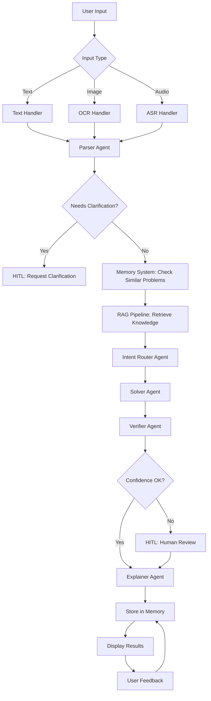

# 🧮 AI Math Mentor

A production-grade, multimodal AI system for solving JEE-level mathematics problems with step-by-step explanations, RAG-based knowledge retrieval, multi-agent reasoning, and human-in-the-loop safeguards.

## 🌟 Features

- **Multimodal Input**: Support for text, image (OCR), and audio (ASR) inputs
- **Multi-Agent System**: 5 specialized agents working together (Parser, Intent Router, Solver, Verifier, Explainer)
- **RAG Pipeline**: Knowledge retrieval from curated math resources
- **Human-in-the-Loop**: Automatic triggering when confidence is low or verification fails
- **Self-Learning Memory**: Stores interactions and learns from corrections over time
- **Transparency**: Full execution trace and source citations
- **Supported Topics**: Algebra, Calculus (basics), Probability, Linear Algebra

## 🏗️ System Architecture



## 📦 Directory Structure

```
AI-Math-Mentor/
├── agents/
│   ├── base_agent.py          # Base agent class
│   ├── parser_agent.py         # Parses raw input into structured format
│   ├── intent_router_agent.py  # Routes to solution strategy
│   ├── solver_agent.py         # Solves with ReAct reasoning
│   ├── verifier_agent.py       # Verifies correctness
│   └── explainer_agent.py      # Creates student-friendly explanations
├── rag/
│   └── rag_pipeline.py         # RAG implementation with FAISS
├── memory/
│   └── memory_system.py        # Interaction storage & self-learning
├── utils/
│   ├── config.py               # Configuration management
│   ├── logger.py               # Logging setup
│   ├── input_handlers.py       # OCR, ASR, text handlers
│   └── orchestrator.py         # Main system orchestrator
├── knowledge_base/
│   ├── algebra_formulas.md
│   ├── calculus_concepts.md
│   ├── probability_concepts.md
│   ├── linear_algebra_basics.md
│   ├── common_mistakes.md
│   └── solution_templates.md
├── app.py                      # Streamlit UI
├── requirements.txt            # Python dependencies
├── .env.example               # Environment variables template
├── .gitignore
└── README.md
```

## 🚀 Setup & Installation

### Prerequisites

- Python 3.8 or higher
- OpenAI API key
- pip or conda for package management

### Installation Steps

1. **Clone the repository**
```bash
git clone https://github.com/Sathwik11-hub/AI-Math-Mentor.git
cd AI-Math-Mentor
```

2. **Create virtual environment (recommended)**
```bash
python -m venv venv
source venv/bin/activate  # On Windows: venv\Scripts\activate
```

3. **Install dependencies**
```bash
pip install -r requirements.txt
```

4. **Set up environment variables**
```bash
cp .env.example .env
```

Edit `.env` and add your OpenAI API key:
```
OPENAI_API_KEY=your_openai_api_key_here
```

5. **Run the application**
```bash
streamlit run app.py
```

The app will open in your browser at `http://localhost:8501`

## 🎯 Usage

### Text Input
1. Select "Text" input method
2. Type your math problem
3. Click "Solve Problem"
4. Review the step-by-step solution and explanation

### Image Input (OCR)
1. Select "Image" input method
2. Upload an image containing the math problem
3. Click "Extract Text from Image"
4. Review and edit the extracted text if needed
5. Click "Solve Problem"

### Audio Input (ASR)
1. Select "Audio" input method
2. Upload an audio file with the problem statement
3. Click "Transcribe Audio"
4. Review and edit the transcript if needed
5. Click "Solve Problem"

### Reviewing Results
- **Solution Tab**: View step-by-step solution, final answer, and explanation
- **Execution Trace Tab**: See how each agent processed the problem
- **Feedback Tab**: Approve/reject solution and provide corrections

## 🧠 Multi-Agent System

### 1. Parser Agent
- Cleans OCR/ASR noise
- Structures problem into standard format
- Identifies topic, variables, constraints, equations
- Detects ambiguity

**Output Format:**
```json
{
  "problem_text": "...",
  "topic": "algebra|calculus|probability|linear_algebra",
  "variables": ["x"],
  "constraints": ["x > 0"],
  "equations": ["x² + 5x + 6 = 0"],
  "needs_clarification": false,
  "confidence": 0.95
}
```

### 2. Intent Router Agent
- Analyzes parsed problem
- Selects optimal solution strategy
- Determines required tools (SymPy, NumPy, etc.)

### 3. Solver Agent
- Uses ReAct-style reasoning
- Applies symbolic manipulation (SymPy)
- Performs numerical computation
- References RAG context
- Provides step-by-step solution

### 4. Verifier Agent
- Checks mathematical correctness
- Validates domain constraints
- Identifies common mistake patterns
- Triggers HITL if needed

**Verification Criteria:**
- Mathematical correctness (substitution check)
- Domain validity (√, log, division, trig)
- Constraint satisfaction
- Confidence threshold: 0.8

### 5. Explainer Agent
- Creates student-friendly explanations
- Highlights key concepts
- Points out common mistakes
- Provides helpful tips

## 📚 RAG Knowledge Base

The system includes curated knowledge documents covering:
- Algebra formulas and concepts
- Calculus (limits, derivatives, optimization)
- Probability and combinatorics
- Linear algebra basics
- Common mistakes to avoid
- Solution templates

Knowledge is automatically:
- Chunked into manageable pieces
- Embedded using sentence transformers
- Stored in FAISS vector database
- Retrieved based on problem similarity

## 🔐 Human-in-the-Loop (HITL)

HITL is triggered when:
- OCR/ASR confidence < 0.7
- Parser finds ambiguity
- Verifier confidence < 0.8
- Critical issues detected
- User requests review

Human can:
- Edit problem statement
- Approve/reject solution
- Provide correct answer
- Submit corrections

All corrections are stored and applied to future similar inputs.

## 🧠 Memory & Self-Learning

The system learns over time by:
- Storing every interaction
- Finding similar past problems
- Reusing successful solution patterns
- Applying learned OCR/ASR corrections
- Incorporating user feedback

**No model retraining required** - learning happens at runtime.

## ⚙️ Configuration

Edit `.env` to customize:

```bash
# Model Selection
OPENAI_MODEL=gpt-4
EMBEDDING_MODEL=text-embedding-ada-002

# Confidence Thresholds
OCR_CONFIDENCE_THRESHOLD=0.7
ASR_CONFIDENCE_THRESHOLD=0.7
VERIFIER_CONFIDENCE_THRESHOLD=0.8

# RAG Settings
RAG_TOP_K=3
CHUNK_SIZE=500
CHUNK_OVERLAP=50

# Whisper Model
WHISPER_MODEL=base  # Options: tiny, base, small, medium, large
```

## 📊 System Requirements

### Minimum
- 4GB RAM
- 2 CPU cores
- Internet connection for OpenAI API

### Recommended
- 8GB RAM
- 4 CPU cores
- GPU for faster Whisper transcription (optional)

## 🚢 Deployment

### Streamlit Cloud

1. Push code to GitHub
2. Go to [share.streamlit.io](https://share.streamlit.io)
3. Deploy from your repository
4. Add `OPENAI_API_KEY` in Secrets

### HuggingFace Spaces

1. Create new Space
2. Upload code
3. Add `OPENAI_API_KEY` to Settings → Secrets

### Docker (Optional)

```dockerfile
FROM python:3.9-slim
WORKDIR /app
COPY requirements.txt .
RUN pip install -r requirements.txt
COPY . .
EXPOSE 8501
CMD ["streamlit", "run", "app.py"]
```

Build and run:
```bash
docker build -t math-mentor .
docker run -p 8501:8501 -e OPENAI_API_KEY=your_key math-mentor
```

## 🔍 Troubleshooting

### Issue: EasyOCR fails to initialize
**Solution:** Ensure you have enough RAM and internet connection for model download

### Issue: Whisper model download fails
**Solution:** Check internet connection, or use a smaller model (`tiny` or `base`)

### Issue: RAG retrieval returns no results
**Solution:** Click "Reinitialize RAG" in the sidebar

### Issue: OpenAI API errors
**Solution:** Verify your API key is correct and has credits

## 📈 Performance Tips

1. **First run is slow**: Models and embeddings are downloaded
2. **Use smaller Whisper models**: `tiny` or `base` for faster ASR
3. **Cache enabled**: Subsequent runs are much faster
4. **RAG initialization**: One-time setup, then fast retrieval

## 🛡️ Security & Privacy

- API keys stored in `.env` (not committed to git)
- User data stored locally in `memory/` directory
- No data sent to third parties except OpenAI API
- All math computations done locally with SymPy

## 📝 Scope & Limitations

### Supported
- ✅ Algebra (JEE level)
- ✅ Basic Calculus (limits, derivatives, simple optimization)
- ✅ Probability & Combinatorics
- ✅ Basic Linear Algebra

### Not Supported
- ❌ Olympiad-level problems
- ❌ Proof-heavy mathematics
- ❌ Advanced topics beyond JEE syllabus
- ❌ Non-English languages

## 🤝 Contributing

Contributions are welcome! Areas for improvement:
- Additional knowledge base documents
- More sophisticated similarity matching
- Better OCR/ASR confidence estimation
- Additional problem domains
- UI enhancements

## 📄 License

MIT License - See LICENSE file for details

## 🙏 Acknowledgments

- OpenAI for GPT models
- LangChain for RAG framework
- EasyOCR for text extraction
- Whisper for audio transcription
- SymPy for symbolic mathematics
- Streamlit for the UI framework

## 📧 Contact

For questions or issues, please open a GitHub issue or contact the maintainer.

---

**Built with ❤️ for JEE students and educators**
